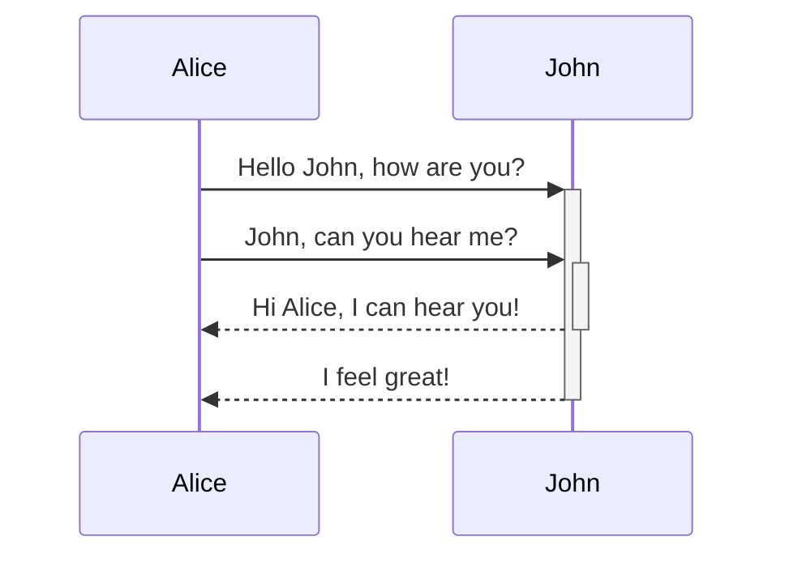
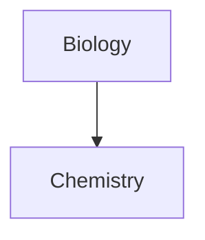

# Basic
### Headings
use # to convert text into headings
'#' for heading lvl 1 to '######' for heading lvl 6

use 'Ctrl + B' to make the text **Bold**

### Bold, Italics, Etc
- `** **` or `__ __` for **Bold**
- `* *` or `_ _` for *Italic*
- `~~ ~~`  for ~~Strikethrough ~~
- `== ==` for ==Highlight==
- `** _ _ **` for **Bold and _nested italic_**
- `*** ***` or `___ ___` for ***Bold and Italic***
- `\` this works for Escape Sequence to enter special character
	- \*\*this text is not bold\*\*
	- \**this text is not bold but italicized*\*
### Links
You can use internal linking in two ways :-
- wikilink: `[[ This is not a real Page ]]`
- markdown: `[This is not a real Page](This%20is%20not%20a%20real%20page.md)`

to use external linking :-
- `[Link Text](URL)` - put url with HTTPS - [Youtube.com](https://youtube.com)

to make a link which open another vault - use `obsidian://`
- `[Link text]((obsidian://open?vault=MainVault&file=file_name.md)`

to add an image from external link:
- `!` add this before the URL 
	- ``
- to change the dimension
	- ``
	- you can only give width and height will be adjusted as per the aspect ratio of original image
	==Original==
	
	==200x100==
	
	==only width 100 is given==
	

### Quotes
can make quote by adding `>` at the start and then use `\-` to write the author name
> Computers are just like AC, If you installed windows, they are Useless

\- Linus Torvalds - developer of Linux

 to make a callout, put `[!info]` at the start of the quote
 >[!info] wahi upar wala
 
### Lists
###### Ordered/Unordered Lists
use `-` to make a unordered list and `1.` to make ordered list
- Unordered list
1. Ordered list

##### Task/To-Do List
use `- [ ]` to make it and put any character inside the bracket to mark it complete `- [ x ]` or click on it in the reading mode ==use space between the characters==
- [ ] This is not Done
- [x] This is Done

##### Nested List
can make any kind of list with nested list
1. one
2. two
	- nested one
	- nested two
3. three
	- [ ] task 1
	- [ ] task 2
		- [ ] nested task 1
`Tab` and `Shift + Tab` to indent and unindent one or more than one selected items of the list

### Horizontal Bars/Dividers
use `_ _ _` to make a divider, ==space is not necessary==, can also use `*` or `-` but this is better

### Code
use ` `` `  for inline code and ` ``` ``` ` for code block
this is the `inline` code
```
this is the code block
```

add a programing language after \`\`\` to highlight the syntax of that
```programming_language_here
code here
```

### Footnotes and comments
you can add footnotes using `[^1]` at the end of the source line and using at the start at the beginning of the reference line.

to add inline footnotes, put caret `^` outside the square bracket

to add comments, use `%% %%`  
and for a comment block, enter like this:
		\%%
		\%%
%%this is a comment%%
%%
this is a comment block, if you can read this, you can not in reading mode and using editing mode
%%

### Exclusive
some of the exclusive obsidian markdown syntaxes are
- `[[ link]]` internal Links
- `![[ link]]` embedding files
- `![[ link#^id]]` block reference
- `^id` defining a block 


# Advance

### Tables
can be created using `|` and `-` , where `|` being used for column separation and `-` being used for column header
tables are only visible in reading mode, not in live preview, spaces after `|` and `-` are must
bars on both ends of the tables are optional and cells are need not to be perfectly aligned
```
Name | Class
-- | --
Shivansh | BCom
Kartikey | BA

Both of these will make same Result

Name     | Class
---------|------
Shivansh | BCom
Kartikey | BA
```

| Name     | Class |
| -------- | ----- |
| Shivansh | BCom  |
| Kartikey | BA    |

| Name     | Class |
| -------- | ----- |
| Shivansh | BCom  |
| Kartikey | BA    |
to add alignment in the text, use `:` in the header column

```
Left alignment | Center alignment | Right alignment
:-- | :--: | --:
left | center | right
```

| Left alignment | Center alignment | Right alignment |
| :------------- | :--------------: | --------------: |
| left           |      center      |           right |

you can use basic formatting syntax to style content inside the table

| Name     |          Website           |
| :------- | :------------------------: |
| Youtube  | [Go](https://youtube.com)  |
| Facebook | [Go](https://facebook.com) |
### Diagrams
to create diagrams, you can use [mermaid](https://mermaid.live/edit#pako:eNpVjr2OwkAMhF_FcsVJ5AVSIB3JQYMEEnRZCitxsivYHzkbIZTk3W9DmjtX9sw3I49Y-4Yxx_bpX7UmiXArlYM031WhxfTRUn-HLNtNR45gveP3BPvN0UOvfQjGdV8rv18gKMbTgjFEbdxjXq3ikz87nqCsThSiD_e_zu3lJ_ipzEWn-v-OFk6pQ9VS3lJWk0BB8kFwi5bFkmnS--OiKIyaLSvM09qQPBQqNyeOhuivb1djHmXgLYofOo2p8NmnawgNRS4NdUJ2ReZfufpaQg) or [Excalidraw](https://https://excalidraw.com/) but it is better to use excalidraw using extension instead of browser version

to use **mermaid**, just make a code block, and replace language_here to mermaid. you have to learn its own syntax before making it since it provide very polished and professional charts
```language_here
sequenceDiagram 
	Alice->>+John: Hello John, how are you? 
	Alice->>+John: John, can you hear me? 
	John-->>-Alice: Hi Alice, I can hear you! 
	John-->>-Alice: I feel great!
```


to use Excalidraw, just open its extension, draw a chart by choosing the desired option and done. it is easy and provide hard draw feel. to put it in the page, just enter the name of the drawing in the `Ctrl + P ==> excalidraw: embed a drawing` and then choose the name of the drawing
![[sample drawing]]
This is a [Excalidraw Showcase Video.](https://www.youtube.com/watch?v=P_Q6avJGoWI&t=3s)

```mermaid_
graph TD 
Biology --> Chemistry
```



for more diagrams and info regarding it, visit [mermaid.com](https://mermaid.js.org)

### Maths
to use mathematics expressions, write them between  `$$` just like code block
```
$$
\begin{vmatrix} a & b\\ 
c & d 
\end{vmatrix}=ad-bc
$$
```
$$
\begin{vmatrix} a & b\\ 
c & d 
\end{vmatrix}=ad-bc
$$
to use inline maths expression, write between `$ $` example: `2 \pi r` or `1^0=1`
the area of circle is $2 \pi r$ or $1^0 = 1$

to learn more about the syntax, visit [MathJax Basic Tutorial](https://math.meta.stackexchange.com/questions/5020/mathjax-basic-tutorial-and-quick-reference)

# More

Take yourself to [[03 Non-Text Syntax|Non-Text Syntax]]


